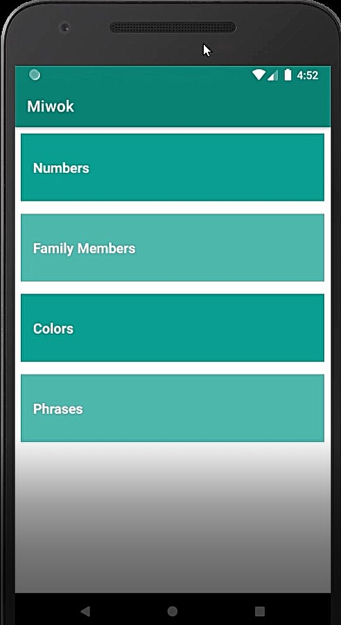
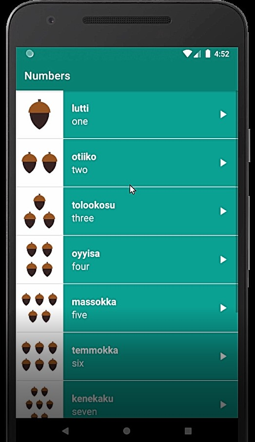
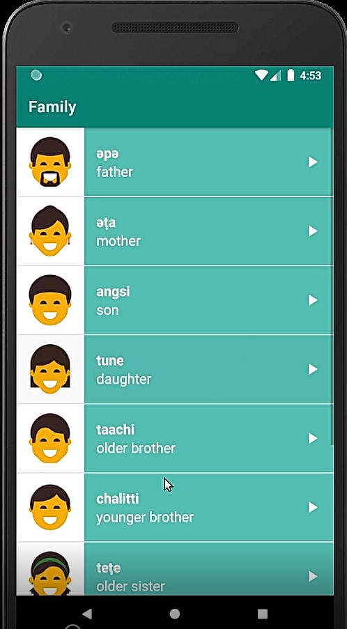
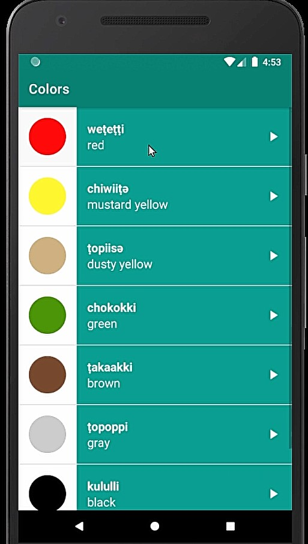
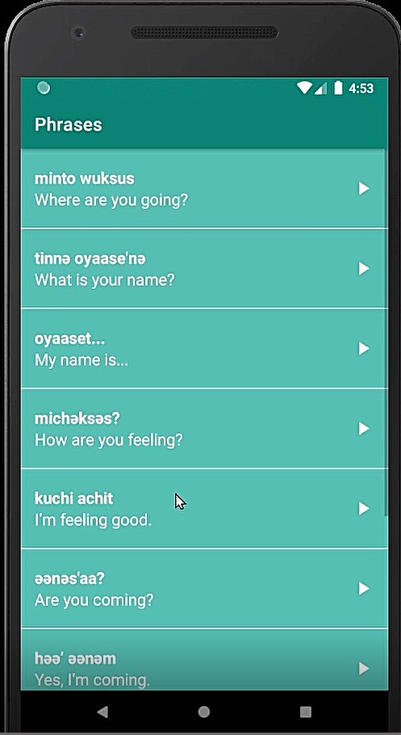

# Miwok App

This app displays lists of vocabulary words for the user to learn the Miwok language. Used in a Udacity course in 
the Beginning Android Nanodegree.

Miwok language is an endangered language which is sadly on the verge of extinction. 
This app displays lists of vocabulary words for the user to learn the Miwok language.

Miwok is an android app created to get familiarized with android basics such as views, layouts, intents, activities, 
MediaPlayer, constraint Layout, Adaptor, ListView, view recycling, audio Focus, onClickListener, 
OnAudioFocusChangeListener, etc

The idea of the App: Miwok is the language of native Americans. In this app, we have a parent activity and 4 
child activities. Parent activity displays the categories.
 On clicking on a category the relevant child activity opens up. Child activities are displayed in a listview. 
Each element in the list has an image,
 Miwok word, English translation of the Miwok word and audio for the Miwok word. When the Number category is 
clicked in the home screen user is navigated to NumbersActivity.
 In the child activity, we used adaptors to implement view recycling. AudioFocus has been implemented in the
 app to avoid playing the app the audio in case of a phone call or other priority apps playing.

The app is built as an effort towards preserving the endangered language.
 It provides English to Miwok translations of common phrases and words using audio files.

The app uses Android’s Fragments, AudioManager, AudioFocus, MediaPlayer classes. It also provides visual feedback (ripple animation) 
when a button is clicked.

ScreenShots
---------------

Lessons Learned
----------
Miwok App learn about Activity,Manifest File,Intents,Event Listener,Interface,Arrays,Array List,Loops,
View Recycling,List View,Custom Class,Custom Array Adapter,Assets,
,Constructor Overloading,Media Player States,
Touch events,Async callbacks,Activity LifeCycle,Audio Focus States.
